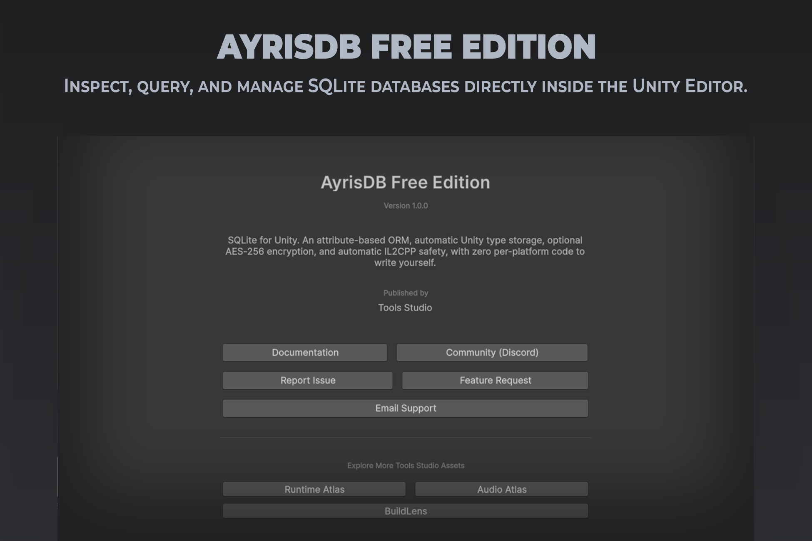

# AyrisDB

SQLite for Unity, with zero configuration.

AyrisDB Free — public Unity Asset Store release.

This repository is AyrisDB's documentation source — the pages themselves, not the product. If you're looking for the product, it's on the Unity Asset Store; if you're reading this on GitHub directly rather than a published site, everything below lives under `docs/`.

## What AyrisDB does

AyrisDB gives Unity projects a SQLite database with an attribute-based ORM, automatic Unity type storage, optional AES-256 encryption, and automatic IL2CPP safety, without writing platform-specific code.

## Main features

- Zero-configuration SQLite connections, with platform paths and journal modes resolved automatically
- An attribute-based ORM with async and sync CRUD methods
- Automatic storage of Unity value types (Vector3, Quaternion, Color, Rect, Bounds) with no manual serialization code
- Optional AES-256 database encryption, with a guard that verifies encryption is actually active
- Automatic IL2CPP safety — `[Table]` types are preserved from code stripping before every build
- An in-Editor Inspector for browsing any open AyrisDB connection's tables, schema, and rows

## Documentation

- [Overview](docs/overview.md)
- [Getting Started](docs/getting-started.md)
- [Installation](docs/installation.md)
- [Configuration](docs/configuration.md)
- [Features](docs/features/)
- [Troubleshooting](docs/troubleshooting.md)
- [FAQ](docs/faq.md)
- [API Reference](docs/api-reference.md)

## Current release

**1.0.0.** Full release history is tracked in AyrisDB's own repositories rather than duplicated here.

## [Getting Started](docs/getting-started.md) &nbsp;&nbsp; [Installation](docs/installation.md) &nbsp;&nbsp; [Features](docs/features/) &nbsp;&nbsp; [Support](SUPPORT)

## [Documentation](https://github.com/tools-studio) &nbsp;&nbsp; [Support](mailto:support.toolsstudio@gmail.com) &nbsp;&nbsp; [Community](https://discord.gg/VrbxQ9vnrT) &nbsp;&nbsp; [Bug Reports](https://discord.gg/XPMGcdnpmn) &nbsp;&nbsp; [Feature Requests](https://discord.gg/Ge99xqt5qr)
