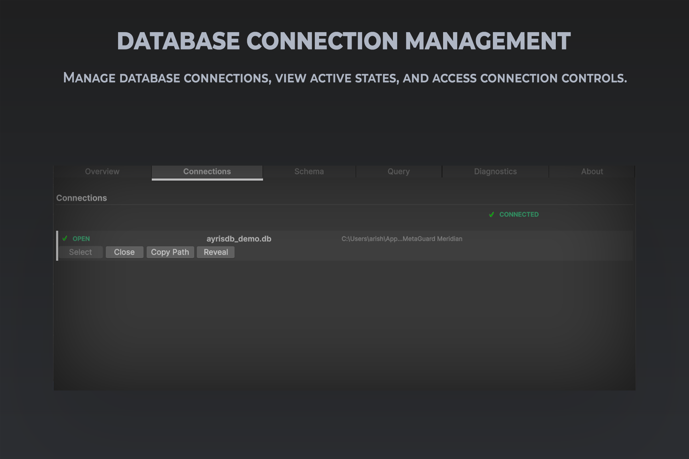
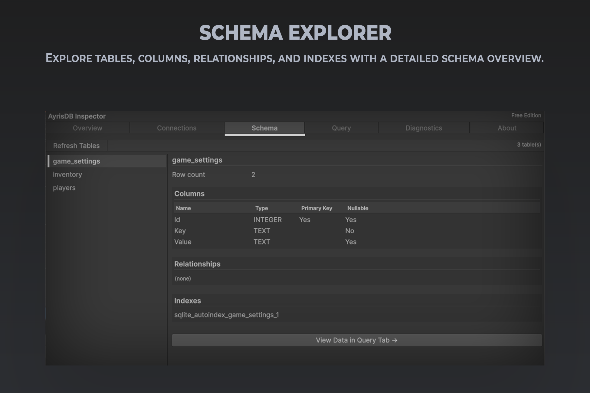
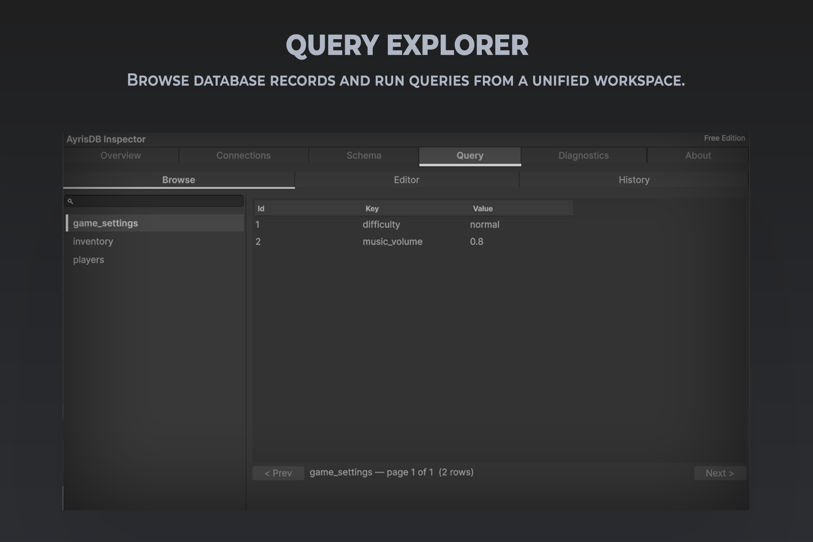
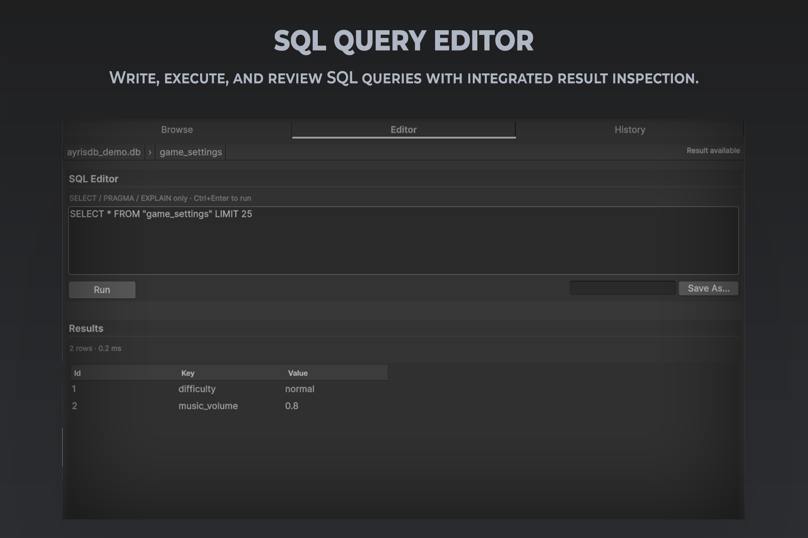
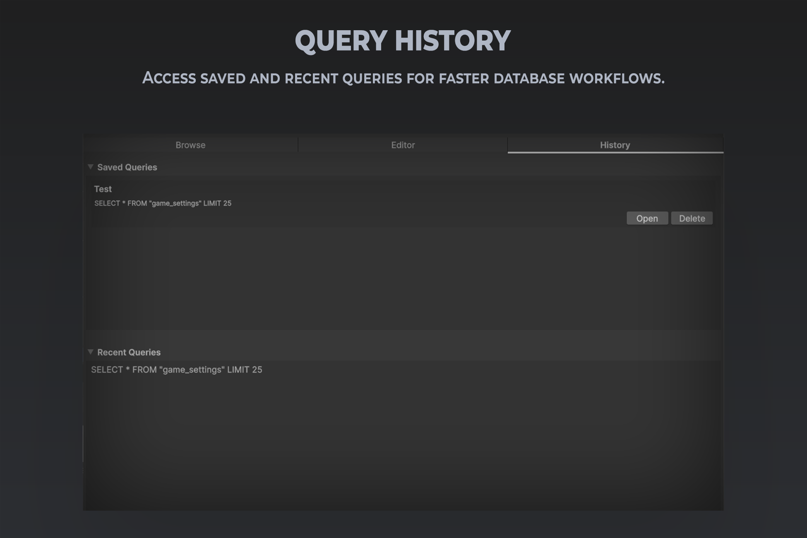
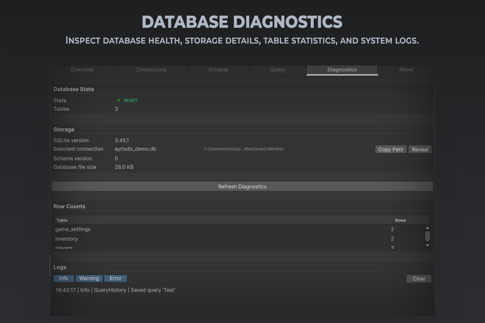

# Inspector

## Purpose

Gives you visibility into a running database's tables, schema, and rows without adding temporary debug logging to your own code.

## Workflow

Open **Tools > AyrisDB > Inspector**. Any connection your game currently has open appears there automatically, whether you're in Play Mode or editing.

## Configuration

No configuration is required.

## Example

Use **Tools > AyrisDB > Create Demo Scene**, then press Play once, to see the Inspector populated with sample data immediately.

## Tabs

**Connections** — every open connection, with its file path and quick actions.

**Schema** — every table's columns and indexes.

**Query > Browse** — a filterable table list alongside a full data grid.

**Query > Editor** — write and run raw SQL, with results shown inline.

**Query > History** — saved and recent queries.

**Diagnostics** — connection health and Editor log history.

