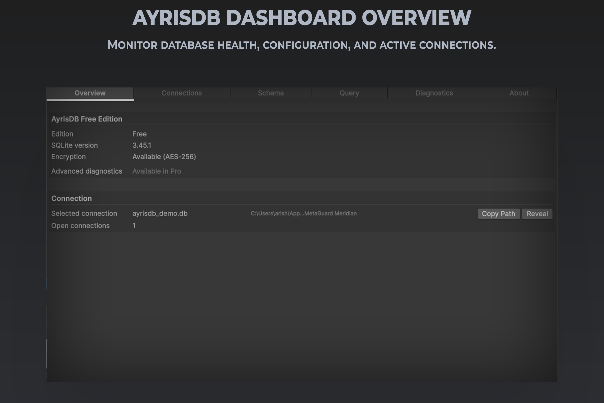

# Overview

AyrisDB gives your Unity project a SQLite database without writing any platform-specific code. You open a connection, describe your tables with attributes on a plain C# class, and call async methods to read and write rows. Correct database paths, journal modes, foreign key enforcement, and integrity checks are all handled for you per platform.

## What it's for

Use AyrisDB when your game needs persistent structured data — save games, player progress, inventories, settings, or any data you'd otherwise reach for a database to hold — and you want that working the same way across Windows, Linux, and WebGL without writing per-platform code yourself.

## Core ideas

**Connections.** [AyrisDB.OpenAsync](api-reference.md) opens or creates a database, resolving the correct path and journal mode for whichever platform you're running on.

**The ORM.** Classes decorated with `[Table]`, `[PrimaryKey]`, and related attributes map directly to SQL tables. You don't write SQL for the common cases, though raw SQL is always available when you need it.

**Unity type storage.** `Vector3`, `Quaternion`, `Color`, `Rect`, and `Bounds` store their components automatically — no manual serialization code.

**IL2CPP safety.** Your `[Table]` types are preserved from IL2CPP code stripping automatically, before every build.

**The Inspector.** An Editor window shows every AyrisDB connection your game currently has open, along with its tables, schema, and rows.

## Where to go next

New to AyrisDB — start with [Getting Started](getting-started.md).
Setting it up in your project — see [Installation](installation.md).
Configuring encryption, journal mode, or other connection options — see [Configuration](configuration.md).
Looking for one specific feature in depth — see [Features](features/).
